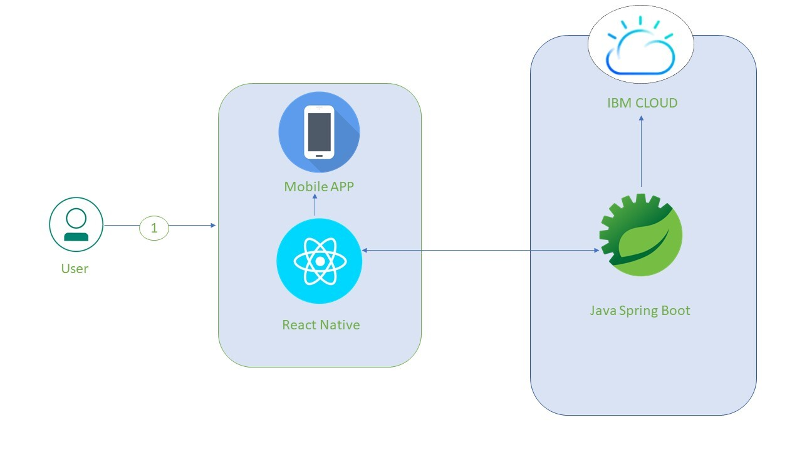

# SafEscape

## Contents

1. [Short description](#short-description)
1. [Demo video](#demo-video)
1. [The architecture](#the-architecture)
1. [Project roadmap](#project-roadmap)
1. [Getting started](#getting-started)
1. [Running the tests](#running-the-tests)
1. [Built with](#built-with)
1. [Authors](#authors)

## Short Description

### What's the problem?

Life for the hospitality industry has changed drastically due to the coronavirus pandemic and the future of hotels will look drastically different in a post COVID world. With new guidelines coming in from the tourism ministry, hotels and accommodation units have to ensure  social distancing and adequate safety & hygiene measures. 

### How can technology help?

Sustaining a hospitality business is all about the amazing guest experience and carving ‘brand identity’ in an ever-evolving market.“Touchless Hospitality” will be the new order. Hotels will now be chosen basis the levels of safety and hygiene instead of the fancy perks. 
Automation in guest-facing hotel functionalities like mobile check-in, in-room smart hotel technology helps in adding the ‘wow’ factor in guest service delivery. It also influences your guest decision making- either they will think – ‘Never here again’ or they will think- ‘I am coming again.’


### The idea

Human beings by nature long for travel and discover new places. Hospitality industry have to shift the way they manage guest services in times of crises such as the COVID-19 pandemic. Providing solution catered to guest comfort & safety, backed by IBM Cloud & Watson Services will enable the hospitality industry to bounce back in business quickly.

## Demo video

[](https://youtu.be/vOgCOoy_Bx0)

## The architecture


## Project roadmap


## Getting started

These instructions will get you a copy of the project up and running on your local machine for development and testing purposes. See deployment for notes on how to deploy the project on a live system.

### Prerequisites

What things you need to install the software and how to install them

```bash
brew install node
brew install watchman
```
For ios:
 1. Xcode from Mac App Store.
 1. CocoaPods
```bash
sudo gem install cocoapods
```
For Android:
```bash
brew cask install adoptopenjdk/openjdk/adoptopenjdk8
```
1. [Android Studio](https://developer.android.com/studio/index.html)
1. Install the Android SDK
1. Configure the ANDROID_HOME environment variable
    Add the following lines to your ```bash $HOME/.bash_profile ``` or ```bash $HOME/.bashrc``` config file:
    ```bash
          export ANDROID_HOME=$HOME/Library/Android/sdk
          export PATH=$PATH:$ANDROID_HOME/emulator
          export PATH=$PATH:$ANDROID_HOME/tools
          export PATH=$PATH:$ANDROID_HOME/tools/bin
          export PATH=$PATH:$ANDROID_HOME/platform-tools
      ```
   For more details on installation [click here](https://reactnative.dev/docs/environment-setup) and select the tab `React Native CLI Quickstart`

### Installing

Step 1:

```bash
git clone https://github.com/Husna-banu/Hackathon-404.git
```
Step 2:
```bash
  cd Hackathon404/frontend/Hackathon404/
  npm install
```
Step 3:
For ios:
```bash
  npm run ios
```
For android:
```bash
  npm start (in one terminal)
  npm run android (in another terminal)
  
  
```
Admin credentials:
```bash
 emailID: hoteladmin@abc.com
 password: hoteladmin@123
 ```
Guest credentials:
```bash
 emailID: hotelguest@abc.com
 password: hotelguest@123
 ```
## Running the tests

As this application is more of user interface, snapshot testing is done which capture each and every bit of UI.
Linting is done to avoid unnecessary warnings and developer errors and for code cleanup. 
Run test case using the below command:

```bash 
  npm t 
```

## Built with

* [Java spring boot](https://spring.io/guides/gs/spring-boot/) - Backend
* [Maven](https://maven.apache.org/) - Dependency management
* [IBM Cloud Foundry Orgs](https://cloud.ibm.com/catalog?search=cloud%20foundary#search_results) - The web framework used
* [React Native](https://reactnative.dev/) - Frontend
* [React Hook](https://reactjs.org/docs/hooks-intro.html) - Application state management


## Authors

* **Harsha Mulani** - *Commander* - [hmulani](https://github.com/hmulani)
* **Snehanjana Ray** - *Backend Developer* - [SnehanjanaRay](https://github.com/SnehanjanaRay)
* **Husna Banu** - *Frontend Developer* - [Husna-banu](https://github.com/Husna-banu)
* **Niharika Sinha** - *Frontend Developer* - [Niharika123](https://github.com/Niharika123)
* **Piyalee Maiti** - *Frontend Developer* - [piyaleemaiti](https://github.com/piyaleemaiti)

